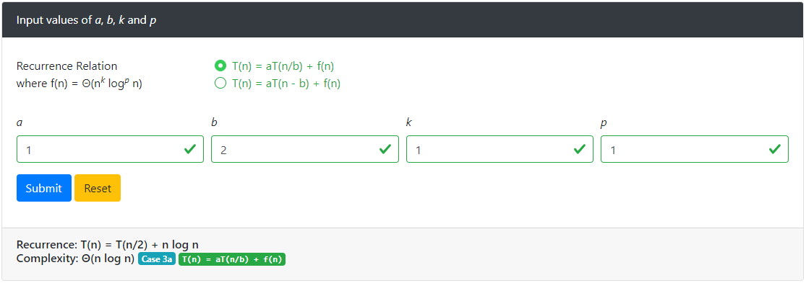

# Solve Recurrence Relation using Master Theorem

Learn to solve recurrence relations and find asymptotic complexity of decreasing and dividing functions using master theorem. See online [demo](http://drunkdeveloper.com/app/master-theorem).

## Master Theorem

Master theorem provides an asymptotic analysis (using Big O notation) for recurrence relations that occur in the analysis of many divide and conquer algorithms. The approach was first presented by Jon Bentley, Dorothea Haken, and James B. Saxe in 1980, where it was described as a "unifying method" for solving such recurrences. The name "master theorem" was popularized by the widely used algorithms textbook Introduction to Algorithms by Cormen, Leiserson, Rivest, and Stein.

### Divide and Conquer

Let <var class="a">a</var> &ge; 1 and <var class="b">b</var> > 1 be constants, let f(n) be a function, and let T(n) be a function over the positive numbers defined by the recurrence 
    T(n) = <var class="a">a</var>T(n/<var class="b">b</var>) + f(n)
    where
    <ul>
        <li><var class="a">a</var> &ge; 1,</li>
        <li><var class="b">b</var> > 1, and</li>
        <li>f(n) = &#x398;(n<var class="k">k</var> log<var class="p">p</var> n), where <var class="k">k</var> &ge; 0 and <var class="p">p</var> &ge; 0</li>
    </ul>

Case 1: If log<var class="b">b</var> <var class="a">a</var> > <var class="k">k</var> then &#x398;(nlog<var class="b">b</var> <var class="a">a</var>)

Case 2: If log<var class="b">b</var> <var class="a">a</var> = <var class="k">k</var> then
    <ol class="ml-5" type="a">
        <li>if <var class="p">p</var> > -1 then &#x398;(n<var class="k">k</var> log<em class="p">p+1</em> n)</li>
        <li>if <var class="p">p</var> = -1 then &#x398;(n<var class="k">k</var> log log n)</li>
        <li>if <var class="p">p</var> < -1 then &#x398;(n<var class="k">k</var>)</li>
    </ol>

Case 3: If log<var class="b">b</var> <var class="a">a</var> < <var class="k">k</var> then
    <ol class="ml-5" type="a">
        <li>if <var class="p">p</var> > 0 then &#x398;(n<var class="k">k</var> log<var class="p">p</var> n)</li>
        <li>if <var class="p">p</var> &le; 0 then &#x398;(n<var class="k">k</var>)</li>
    </ol>

### Decrease and Conquer

Let <var class="a">a</var> > 0 and <var class="b">b</var> > 0 be constants, let f(n) be a function, and let T(n) be a function over the positive numbers defined by the recurrence 
    T(n) = <var class="a">a</var>T(n - <var class="b">b</var>) + f(n)
    where
    <ul class="list-unstyled ml-5">
        <li><var class="a">a</var> > 0,</li>
        <li><var class="b">b</var> > 0, and</li>
        <li>f(n) = &#x398;(n<var class="k">k</var> log<var class="p">p</var> n), where <var class="k">k</var> &ge; 0 and <var class="p">p</var> &ge; 0</li>
    </ul>

Case 1: If a < 1 then &#x398;(f(n)) = &#x398;(n<var class="k">k</var> log<var class="p">p</var> n)

Case 2: If a = 1 then &#x398;(n * f(n)) = &#x398;(n<em class="k">k+1</em> log<var class="p">p</var> n)

Case 3: If a > 1 then &#x398;(<var class="a">a</var>n/<var class="b">b</var> * f(n)) = &#x398;(<var class="a">a</var>n/<var class="b">b</var> n<var class="k">k</var> log<var class="p">p</var> n)

## Solve Recurrence Relation

## License

The code is open-sourced, licensed under the [MIT license](https://opensource.org/licenses/MIT).